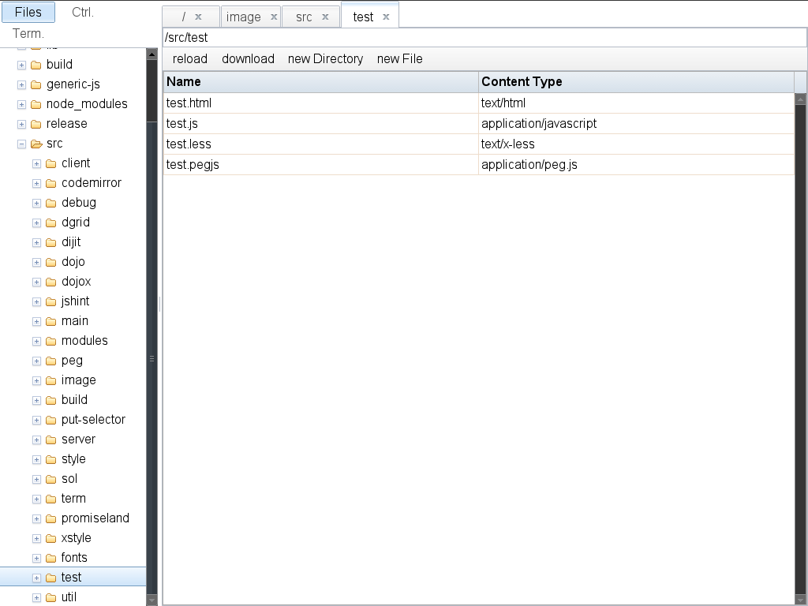
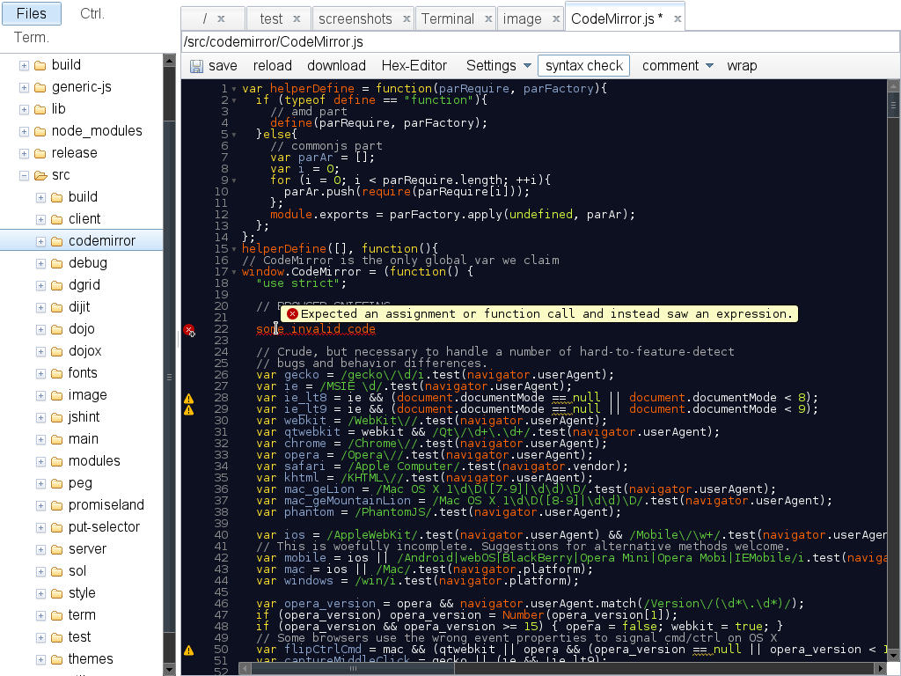
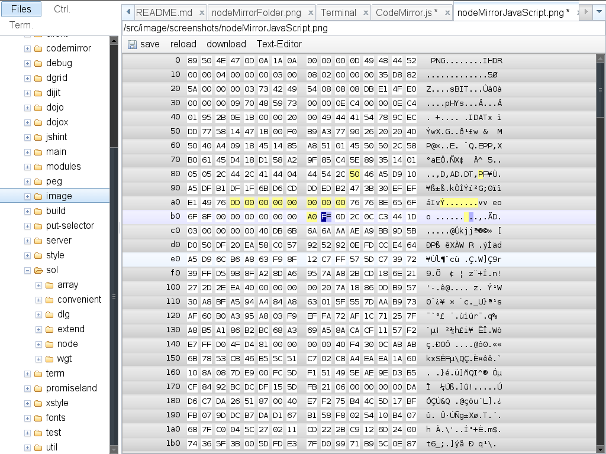
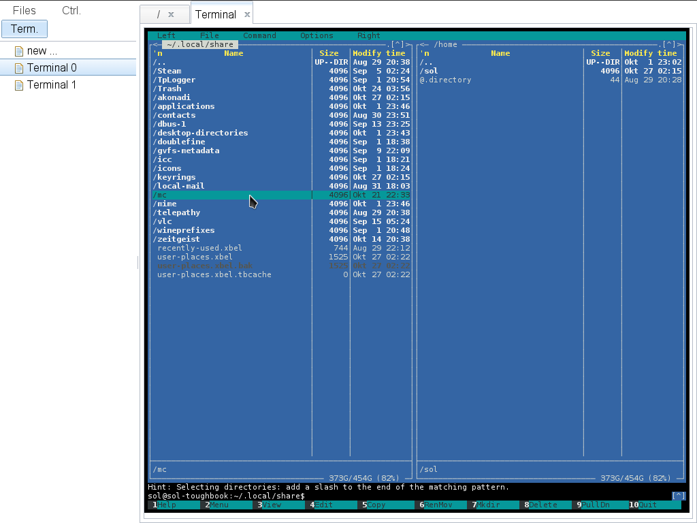
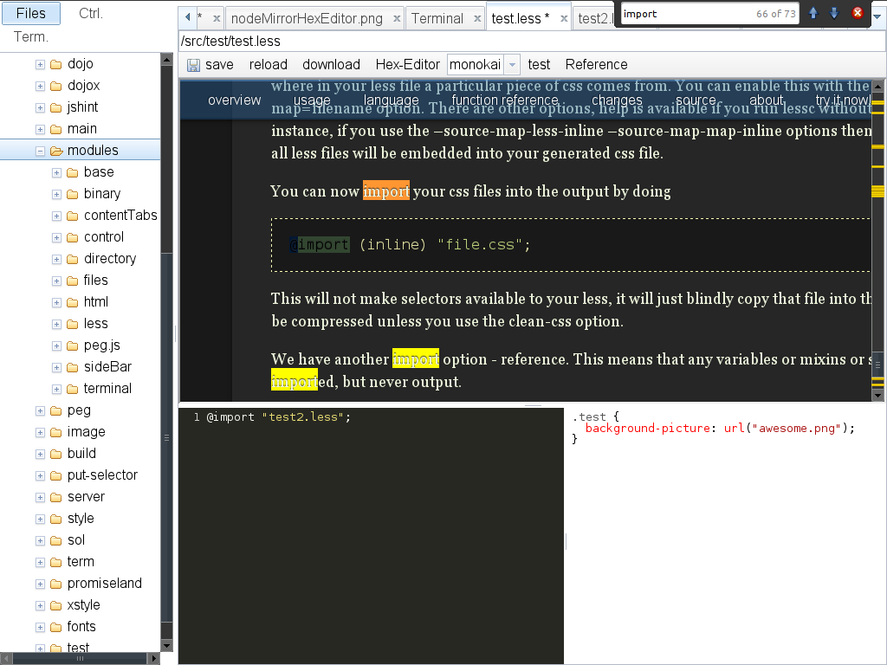
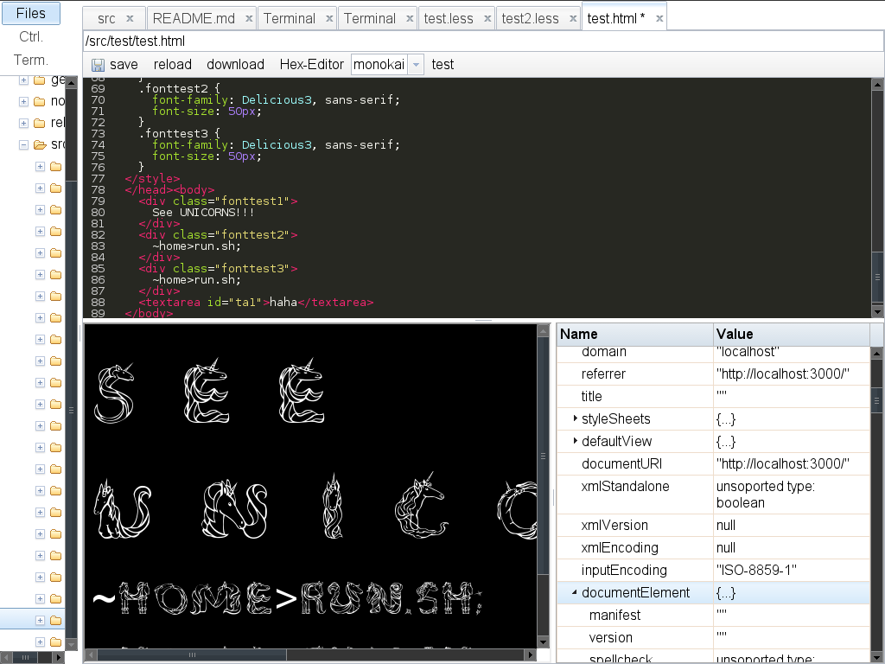
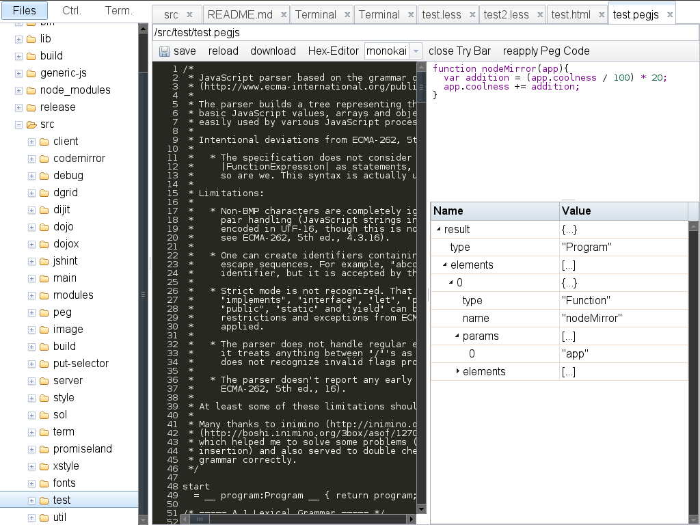

## tldr  
  
  --> [screenshots](#screenshots)
  
## Description

A IDE build around CodeMirror.net.  
If you dont know CodeMirror.net, please check it out. Its a great Project.  
This projects aim is to follow the CodeMirror philosophy of pluginability and simplistic approach to give you a full (Web)Developer IDE.  
So all you need is:  
 - a Computer (unix recommended but windows is supported as well)  
 - node.js  
 - this Project  
  
and you have answered the Question about which Editor to choose.  
You will be able to edit your code from anywhere you want. if you dont like the colors you just change em. if support for a mimetype is missing you can just add it.  
You will never again have to be frustrated about a missing feature within your IDE because you can just add it. At least if you know JavaScript.  

features:  
 - view / edit all content/types supported by CodeMirror.net  
 - view / edit all files in text mode or download them  
 - html tester / analyzer  
 - .less tester / .less online help / save your .less file immediately as .css file  
 - awesome hexeditor  
 - integrated pegjs parser debugger  
 - download directories as zip files (alpha)   
 - Terminals (!)  

## Files Module  
  
For every Content Type where a CodeMirror Mode exists, a CodeMirror instance will be opened. Also every content Type starting with text/* will be opened using CodeMirror.  
For all other files there is a download button.  
If a file is opened for which no native Text Mode exists it will be opened in a Hex Editor. You can switch between hex view and text view.
  
  
## Terminal Module  
  
utilizing pty.js nodeMirror allows you to have several terminals within your browser. the Terminals will stay open when you close your browser window. You can even have the same terminal open on different browsers / machines opening new possibilities for collaboration.   
  
  
## Security  
  
pass username and password to secure your local files from being hacked  
  
  
## Usage  
  
`
npm install node-mirror  
`  
  
`
node node_modules/node-mirror/bin/nodeMirror.js --port 3000 --dir /home/sol/projects --username sol --password mysupersecretpassword
`  

`
http://127.0.0.1:3000/  
`

this is still beta. but i am using this for development so you can expect more.  
i am getting pretty comfortable with this project. maybe i will release 0.1 soon.

the npm distribution is a release build  

check out my git page to get the development version which you can use to customize node-mirror  
there is a build script that lets you build your own node-mirror  

to switch of the experimental terminal or debugger use this command line parameters  

`
node node_modules/node-mirror/bin/nodeMirror.js --no-terminal --no-debug
`  

## Special Thanks  
  
* CodeMirror ( http://codemirror.net/ )  
for creating the most developer friendly editor  
  
* pty.js ( https://github.com/chjj/pty.js )  
for making terminals in node.js possible  
  
* all the contributers, testers and users  
for making this a great IDE  
  
  
# screenshots
  

  Browse your project folder  
  

  edit JavaScript with online Syntax Check  
  

  edit huge Files with the Hex Editor  
  

  Yes you can use midnight commander in your Browser with your Mouse(!)  
  Thank you pty.js  
  

  Have less online help available while testing your less file before saving it parallel as .less and .css file.  
  

  test and analyse your HTML  
  

  test and analyse your HTML  
    

  try out that cool parser you just wrote  
  
  
## License

BSD
